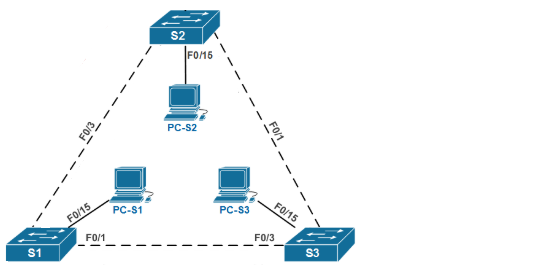

# Настройка расширенных сетей VLAN, VTP и DTP

## 	Таблица адресации.

| Заголовок таблицы    | Интерфейс      | IP-адрес                 | Маска подсети       | 
|---------------------:|:---------------|-------------------------:|:--------------------|
| S1                   | VLAN 99        | 192.168.99.1             | 255.255.255.0       | 
| S2                   | VLAN 99        | 192.168.99.2             | 255.255.255.0       | 
| S3                   | VLAN 99        | 192.168.99.3             | 255.255.255.0       | 
| PC-A                 | NIC            | 192.168.10.1             | 255.255.255.0       | 
| PC-B                 | NIC            | 192.168.20.1             | 255.255.255.0       | 
| PC-C                 | NIC            | 192.168.10.2             | 255.255.255.0       | 

## Задание 
1. Настроить VTP
2. Настроить DTP
3. Добавить сети VLAN и назначение портов
4. Настроить расширенные сети VLAN

## Решение 
1. [Настроим VTP](#VTP)
2. [Настроим динамический протокол транкинг (DTP)](#DTP)
   * Настроим динамический магистральный канал между S1 и S2
   * Настроим статическоий магистральный канал между S1 и S3
3. Добавим сеть VLAN и назначение портов
   * Добавим сети VlAN на коммутарах
   * Проверим обновление VTP на коммутаторах S1 и S3
   * Назначим порты сетям VLAN
   * Настроим IP-адреса на коммутаторах 
   * Проверим наличие сквозного соединения
4. Настроим сети VLAN расширенного диапозона
   * Переведем VTP на коммутаторе S1 в прозрачный режим
   * Настроим сеть VLAN расширенного диапазона на коммутаторе S1

* Switch(config)#**vtp domain CCNA**
* Domain name already set to CCNA.
* Switch(config)#**vtp mode server**
* Device mode already VTP SERVER.
* Switch(config)#**vtp password cisco**
* Password already set to cisco
* Switch#**sh vtp status**
* VTP Version                     : 2
* Configuration Revision          : 8
* Maximum VLANs supported locally : 250
* Number of existing VLANs        : 9
* VTP Operating Mode              : Server
* VTP Domain Name                 : CCNA
* VTP Pruning Mode                : Disabled
* VTP V2 Mode                     : Disabled
* VTP Traps Generation            : Disabled
* MD5 digest                      : 0x16 0x68 0xF2 0x0B 0x67 0x31 0x81 0x1B 
* Configuration last modified by 0.0.0.0 at 3-1-93 00:40:06
* Local updater ID is 0.0.0.0 (no valid interface found)

S1(config)# interface f0/1
