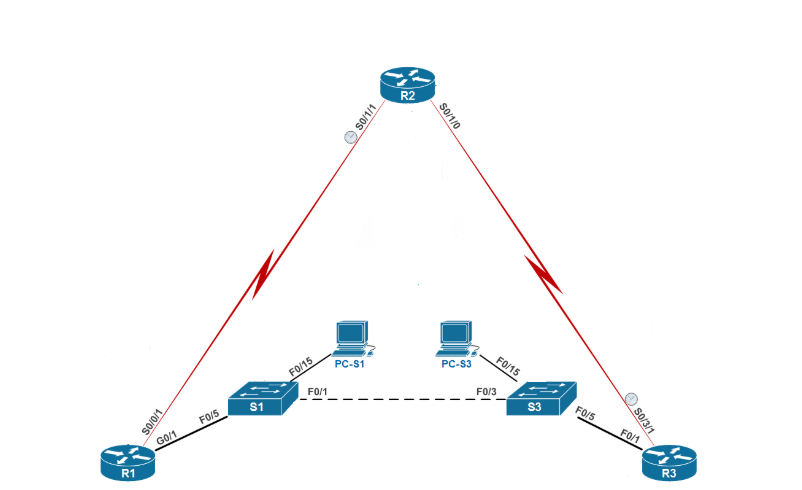

# Лабораторная работа. Настройка HSRP



Таблица адресации

| Устройство | Интерфейс | IP-адрес        | Маска подсети   | Шлюз по умолчанию |
| ---------- | --------- | --------------- | --------------- | ----------------- |
| R1         | G0/1      | 192.168.1.1     | 255.255.255.0   | -                 |
|            | S0/0/1    | 10.1.1.1        | 255.255.255.0   | -                 |
| R2         | S0/1/1    | 10.1.1.2        | 255.255.255.0   | -                 |
|            | S0/1/0    | 10.2.2.2        | 255.255.255.0   | -                 |
|            | Lo1       | 209.165.200.225 | 255.255.255.224 | -                 |
| R3         | F0/1      | 192.168.1.3     | 255.255.255.0   | -                 |
|            | S0/3/1    | 10.2.2.1        | 255.255.255.252 | -                 |
| S1         | VLAN1     | 192.168.1.11    | 255.255.255.0   | 192.168.1.1       |
| S3         | VLAN1     | 192.168.1.13    | 255.255.255.0   | 192.168.1.3       |
| PC-S1      | NIC       | 192.168.1.31    | 255.255.255.0   | 192.168.1.1       |
| PC-S3      | NIC       | 192.168.1.33    | 255.255.255.0   | 192.168.1.3       |

Задачи

1. [Построение сети и проверка соединения](#HSRP1)
2. [Настройка обеспечения избыточности на первом хопе с помощью HSRP](#HSRP2)

## Построение сети и проверка связи<a name="HSRP1"></a>

### Произведем базовую настройку маршрутизаторов

Ниже пример, с полной конфигурацией каждым из маршрутизаторов можно ознакомиться [тут]()

```
(config)#no ip domain-lookup 
(config)#hostname R2 
(config)#interface serial 0/1/0
(config-if)#ip address 10.2.2.2 255.255.255.252
(config-if)#no shutdown
(config-if)#exit
(config)#interface serial 0/1/1
(config-if)#ip address 10.1.1.2 255.255.255.252
(config-if)#clock rate 128000
(config-if)#no shutdown
(config-if)#exit
(config)#interface loopback 1
(config-if)#ip address 209.165.200.225 255.255.255.224
(config-if)#exit
(config)#enable secret class
(config)#line console 0
(config-line)#password cisco
(config-line)#login
(config-line)#logging synchronous
(config-line)#exit
(config)#line vty 0 15
(config-line)#password cisco
(config-line)#login
(config-line)#^Z
#copy running-config startup-config
```

### Произведем базовую настройку коммутаторов

Ниже пример, с полной конфигурацией каждым из коммутаторов можно ознакомиться [тут]()

```
 (config)#no ip domain-lookup
(config)#hostname S1 
(config)#enable secret class
(config)#line console 0
(config-line)#password cisco
(config-line)#login
(config-line)#logging synchronous
(config-line)#exit
(config)#line vty 0 15
(config-line)#password cisco
(config-line)#login
(config-line)#exit
(config)#interface vlan 1
(config-if)#ip address 192.168.1.11 255.255.255.0
(config-if)#no shutdown
(config-if)#exit
(config)#ip default-gateway 192.168.1.1
(config)#^Z
#copy running-config startup-config
```

### Проверим подключение между PC-S1 и PC-S3


### Настроим маршрутизацию RIP

R1

```
(config)#router rip
(config-router)#version 2
(config-router)#no auto-summary
(config-router)#do sh ip route conn
Codes: L - local, C - connected, S - static, R - RIP, M - mobile, B - BGP
       D - EIGRP, EX - EIGRP external, O - OSPF, IA - OSPF inter area 
       N1 - OSPF NSSA external type 1, N2 - OSPF NSSA external type 2
       E1 - OSPF external type 1, E2 - OSPF external type 2
       i - IS-IS, su - IS-IS summary, L1 - IS-IS level-1, L2 - IS-IS level-2
       ia - IS-IS inter area, * - candidate default, U - per-user static route
       o - ODR, P - periodic downloaded static route, H - NHRP, l - LISP
       + - replicated route, % - next hop override
Gateway of last resort is not set
      192.168.1.0/24 is variably subnetted, 2 subnets, 2 masks
C        192.168.1.0/24 is directly connected, GigabitEthernet0/1
L        192.168.1.1/32 is directly connected, GigabitEthernet0/1
(config-router)#network 10.0.0.0 
(config-router)#network 192.168.1.0
(config-router)#^Z
#copy running-config startup-config
```

R2

```
(config)#router rip
(config-router)#version 2
(config-router)#no auto-summary
(config-router)#do sh ip route conn
     209.165.200.0/27 is subnetted, 1 subnets
C       209.165.200.224 is directly connected, Loopback1
     10.0.0.0/30 is subnetted, 1 subnets
C       10.1.1.0 is directly connected, Serial0/1/0
(config-router)#network 10.0.0.0 
(config-router)#^Z
#copy running-config startup-config
//Настроим маршрут по умолчанию с использованием Lo1 в качестве интерфейса выхода в сеть //209.165.200.224/27
(config)#ip route 0.0.0.0 0.0.0.0 loopback 1
(config)#^Z
#copy running-config startup-config
//Перераспеделим маршрут по умолчанию в процесс RIP
(config)#router rip
(config-router)#default-information originate
(config-router)#^Z
#copy running-config startup-config
```

R3

```
(config)#router rip
(config-router)#version 2
(config-router)#no auto-summary
(config-router)#do sh ip route conn
Codes: L - local, C - connected, S - static, R - RIP, M - mobile, B - BGP
       D - EIGRP, EX - EIGRP external, O - OSPF, IA - OSPF inter area 
       N1 - OSPF NSSA external type 1, N2 - OSPF NSSA external type 2
       E1 - OSPF external type 1, E2 - OSPF external type 2
       i - IS-IS, su - IS-IS summary, L1 - IS-IS level-1, L2 - IS-IS level-2
       ia - IS-IS inter area, * - candidate default, U - per-user static route
       o - ODR, P - periodic downloaded static route, H - NHRP, l - LISP
       + - replicated route, % - next hop override
Gateway of last resort is not set
      10.0.0.0/8 is variably subnetted, 2 subnets, 2 masks
C        10.2.2.0/30 is directly connected, Serial0/3/1
L        10.2.2.1/32 is directly connected, Serial0/3/1
      192.168.1.0/24 is variably subnetted, 2 subnets, 2 masks
C        192.168.1.0/24 is directly connected, FastEthernet0/1
L        192.168.1.3/32 is directly connected, FastEthernet0/1
(config-router)#network 10.0.0.0 
(config-router)#network 192.168.1.0
(config-router)#^Z
#copy running-config startup-config
```

Проверим подключение с компьютеров PC-S1 и PC-S2 на все интерфейсы маршрутизаторов


Когда убедились что все пинги проходят  до всех интерфейсов проходят, можно приступить к настройке HSRP

## Настройка обеспечения избыточности на первом хопе с помощью HSRP<a name="HSRP2">

Для начало посмотрим путь до loopback-адреса 209.165.200.225 от PC-S1

Tracing route to 209.165.200.225 over a maximum of 30 hops

 1   1 ms   1 ms   1 ms 192.168.1.1

 2  13 ms  13 ms  13 ms 209.165.200.225

Путь от PC-S1 проходить через R1

Tracing route to 209.165.200.225 over a maximum of 30 hops

 1   1 ms   1 ms   1 ms 192.168.1.3

 2  13 ms  13 ms  13 ms 209.165.200.225

Путь от PC-S3 проходить через R3

Далее запустим не прерывный пинг и разорвем соединение между S1 и R1


Как видно маршрут до R2 стал не доступен
Попробуем проделать все тоже самое только с PC-S3, только перед этим включим соединение между S1 и R1


Результат одинаковый

##### Настроим HSRP на R1 и R3

В этом шаге предстоит настроить HSRP и изменить адрес шлюза по умолчанию на компьютерах PC-S1, PC-S3, S1 и коммутаторе S2 на виртуальный IP-адрес для HSRP. R1 назначается активным маршрутизатором с помощью команды приоритета HSRP.
R1

```
R1(config)# interface g0/1
R1(config-if)# standby version 2
R1(config-if)# standby 1 ip 192.168.1.254
R1(config-if)# standby 1 priority 150
R1(config-if)# standby 1 preempt
```

R3

```
R3(config)# interface g0/1
R3(config-if)# standby version 2
R3(config-if)# standby 1 ip 192.168.1.254
```

Проверим HSRP на R1

```
R1# show standby
GigabitEthernet0/1 - Group 1 (version 2)
  State is Active
    4 state changes, last state change 0:00:30
  Virtual IP address is 192.168.1.254
  Active virtual MAC address is 0000.0c9f.f001
    Local virtual MAC address is 0000.0c9f.f001 (v2 default)
Hello time 3 sec, hold time 10 sec
    Next hello sent in 1.696 secs
  Preemption enabled
  Active router is local
  Standby router is 192.168.1.3, priority 100 (expires in 11.120 sec)
  Priority 150 (configured 150)
  Group name is "hsrp-Gi0/1-1" (default)

```


Проверим HSRP на R3

```
R3# show standby
GigabitEthernet0/1 - Group 1 (version 2)
  State is Standby
    4 state changes, last state change 0:02:29
  Virtual IP address is 192.168.1.254
  Active virtual MAC address is 0000.0c9f.f001
    Local virtual MAC address is 0000.0c9f.f001 (v2 default)
  Hello time 3 sec, hold time 10 sec
    Next hello sent in 0.720 secs
  Preemption disabled
  Active router is 192.168.1.1, priority 150 (expires in 10.128 sec)
    MAC address is d48c.b5ce.a0c1
  Standby router is local
  Priority 100 (default 100)
  Group name is "hsrp-Gi0/1-1" (default)

```

Исходя из того что видим, активным маршрутизатором является R1 `State is Active`
Для виртуального IP-адреса используется MAC-адрес 0000.0c9f.f001 `Active virtual MAC address is 0000.0c9f.f001`
IP-адрес и приоритет для резервного маршрутизатора `Standby router is 192.168.1.3, priority 100`

Посмотрим сводку состояния HSRP


Далее изменим адрес шлюза по умолчанию для PC-S1, PC-S3,  S1, S3 на 192.168.1.254

Проверим пингом 

Поставим на не прерывный пинг с PC-S1 и попробуем снова разорвать соединение между S1 и R1

Как видим эхо-запрос прервался на короткое время и дальше продолжился, потому что произошло переключение на резервный маршрутизатор R3


Теперь обратно включил интерфейс F0/5


Теперь изменим приоритет  на 200 на маршрутизаторе R3, чтобы сделать его активным надо прописать команду `standby 1 preempt`


*Избыточность в локальной сети актуальна особенно там, где малейший простой может обернуться серьезными потерями. Чтобы такого не случилось, были разработаны специальные протоколы: всем известный STP, разнообразные протоколы агрегации каналов, протоколы, обеспечивающие отказоустойчивость шлюза по умолчанию. 
